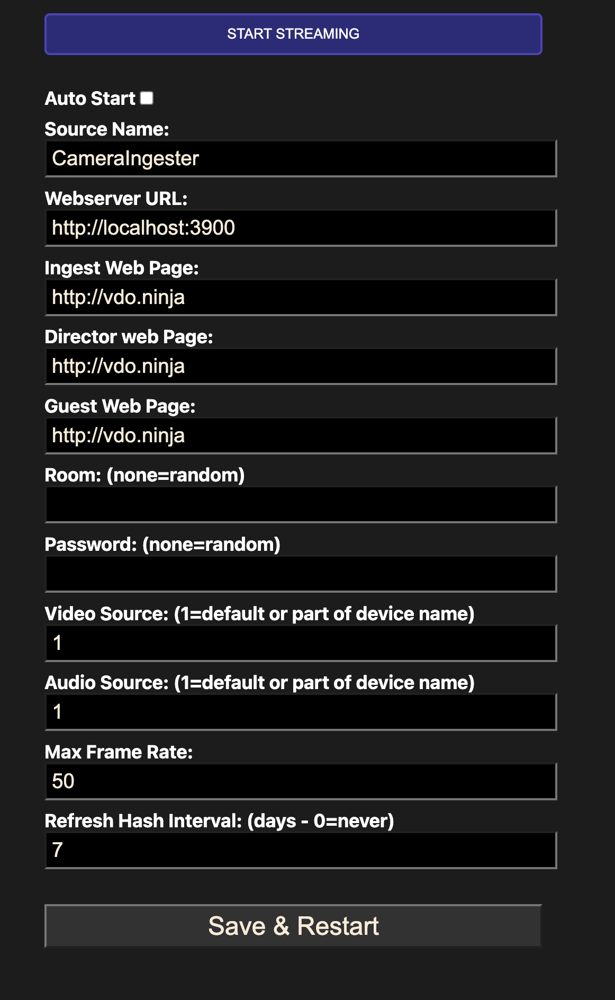
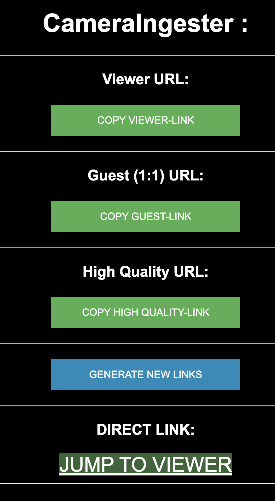

# Ninja Player
A tool for ingesting video into VDO.Ninja

After trying out different methods for ingesting video into WebRTC, i came to the conclusion that Browser engines are the most updated in functionality and speed, so i decided to create a tool that would allow me to ingest video into WebRTC using the Electron Browser engine.

## Features
* Ingests video from a live source
* REST API for getting links to the videostreams

## Screen layout:

## Configuration
- Auto Start: Start the player automatically when the page loads, when restarting the app will autostart and not show the settings menu, go to the menubar and select "disable auto start" if you need to change the settings.
- Ingest Web Page: The URL of the WebRTC server
- Guest Web Page: Optional, if there's different link for ingest/director and guests/viewers
- Director Web Page: Optional, if there's different link for ingest/director and guests/viewers.
- Room and Password: If you wish static room and password, you can set it here. Otherwise, it will be generated randomly.
- Video Source: 1 is the default camera, if you wish another source, you can write a part of the devicename here. For example, if you have a Logitech C920, you can write "Logitech" here.
- Audio Source: Same as video source, but for audio.
- Max Frame Rate: The maximum framerate to use for the video. If you have a beandwith issues you can for clients not to use higher framerates
- Refresh Hash Interval: How often you wish to restart the client. (Used for regenerating random hash-codes, e.g. you only wish that links works for 7 days)

## REST API
### Get url links:
GET http://127.0.0.1:3900/linkurl returns:
{
    viewer: (linkto viewer)
    guest: (linkto guest)
    director: (linkto director)
}

### Restart Ninja Player:
POST http://localhost:3900/engine?action=restart

### Quit Ninja Player:
POST http://localhost:3900/engine?action=quit

## LINK WEBPAGE

There's a build in webserver that serves a webpage with links to the videostreams. You can access it by going to http://localhost:3900

